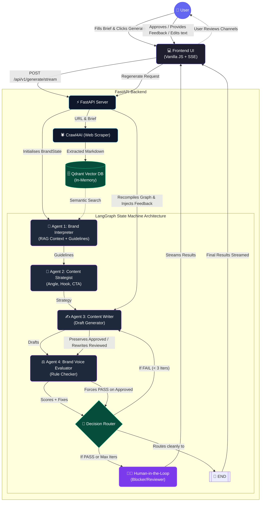
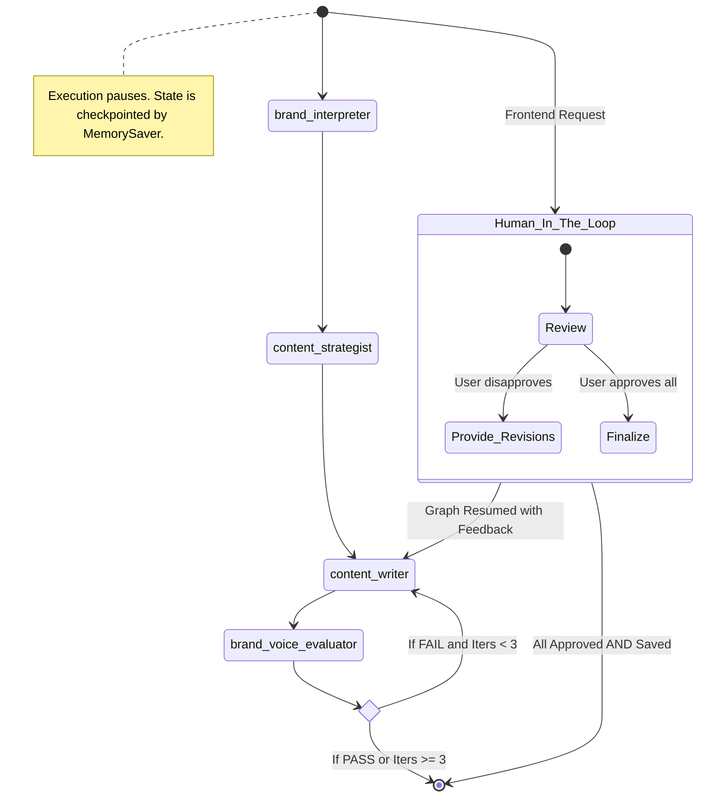

# BrandForge Architecture

BrandForge is built on a highly modular, event-driven multi-agent architecture using **LangGraph**, **FastAPI**, and **Qdrant**. The system is designed to seamlessly ingest brand data, generate tailored marketing content across multiple channels, self-evaluate its own output, and pause for granular Human-in-the-Loop (HITL) review.

## High-Level System Architecture

## LangGraph State Machine (Nodes & Edges)

The core cyclic graph mapped directly from `graph/pipeline.py`. This relies on `StateGraph(BrandState)` and manages the actual rewrite and refinement loops:

## Core Components Breakdown

### 1. The Engine (`graph/pipeline.py`)
This is the heart of the system. It compiles the `StateGraph` using the agents as nodes. It uses LangGraph's `MemorySaver` to checkpoint the state at every node, allowing the system to pause execution (when waiting for human feedback) and securely resume a specific `thread_id` without losing context.

### 2. Shared Memory (`graph/state.py`)
BrandForge relies on a strictly typed `BrandState` dictionary. Instead of passing messages chaotically, every agent receives the *entire* state, makes its specific updates, and returns its slice. LangGraph automatically merges these updates.
**Key elements tracked:**
- `rag_stats`: Vector DB indexing stats.
- `content_strategy`: The angles formulated by Agent 2.
- `content_drafts`: The raw copy generated by Agent 3.
- `human_feedback`: JSON payload mapping approved channels and targeted rewriting directives.

### 3. Retrieval-Augmented Generation (`rag/brand_memory.py`)
Crawled content isn't dumped raw into the prompt (saving tokens and improving accuracy). Crawl4AI extracts the text, LangChain's `RecursiveCharacterTextSplitter` chunks it (600 chars), and it is embedded into an in-memory `Qdrant` collection using `text-embedding-3-small`. Agent 1 queries this vector space dynamically to figure out tone, target audience, and feature sets.

### 4. Agent Assembly (`agents/`)
- **Agent 1 (Brand Interpreter)**: Searches Qdrant for identity queues and constructs the foundational "Brand Bible" (Tone Rules, Content Pillars, Exact Target Summary).
- **Agent 2 (Content Strategist)**: Takes the pipeline brief and dictates *how* each channel should attack the hook and CTA.
- **Agent 3 (Content Writer)**: Uses the rules from Agent 1 and the angles from Agent 2 to generate the actual copy. When a loop occurs or when human feedback is provided, it specifically searches for the JSON `human_feedback` state and *skips* channels marked `approved`, rewriting the rest.
- **Agent 4 (Brand Voice Evaluator)**: The automated QA. Uses structured output to guarantee adherence. Auto-forgives channels explicitly approved by the human expert.

### 5. Frontend Streaming client (`frontend/js/app.js`)
Instead of long-polling, the Frontend communicates with the Backend via standard Server-Sent Events (SSE). It reads `data:` chunks buffered through `python-asyncio` yields, instantly triggering animations, progress ticks, and the final Human-in-the-Loop review panel without dropping the connection.
